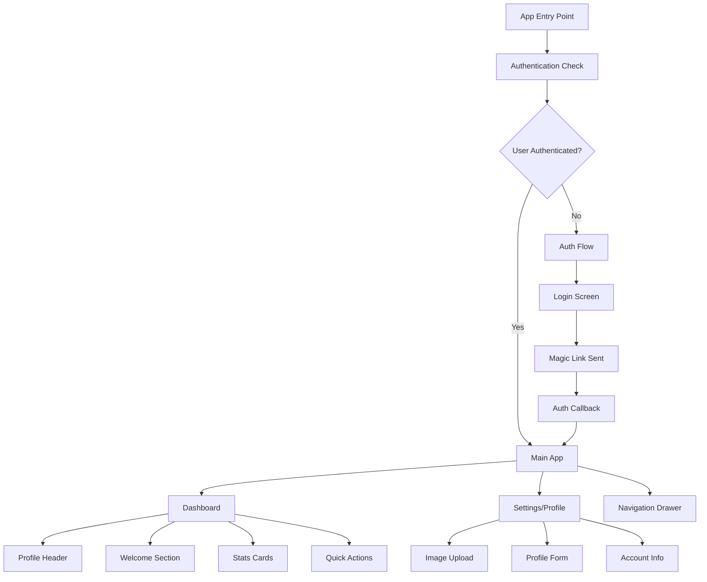
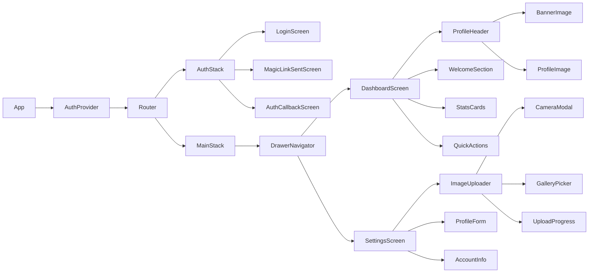
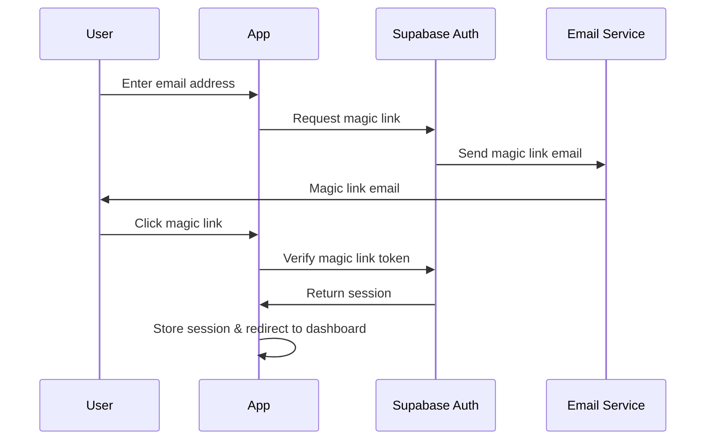
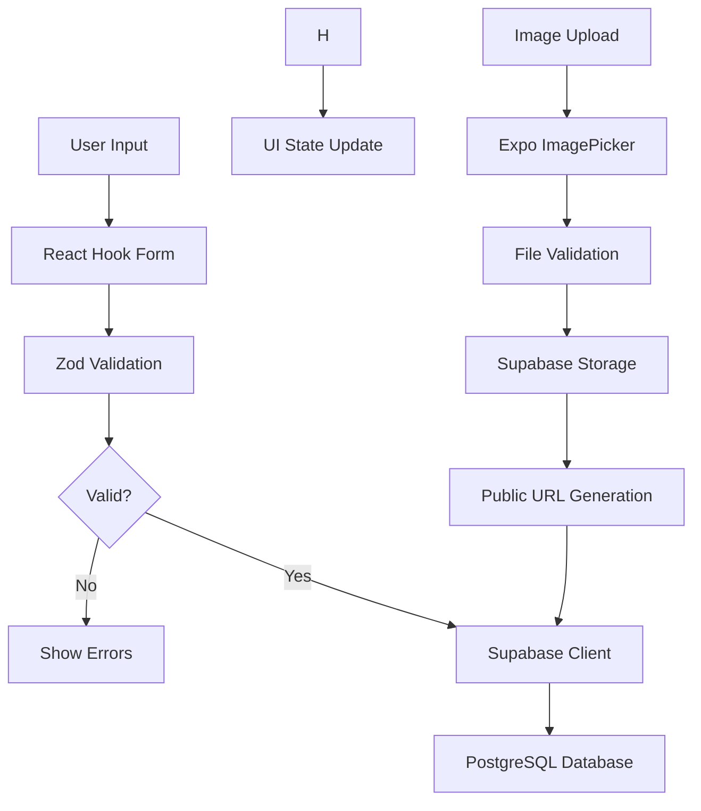
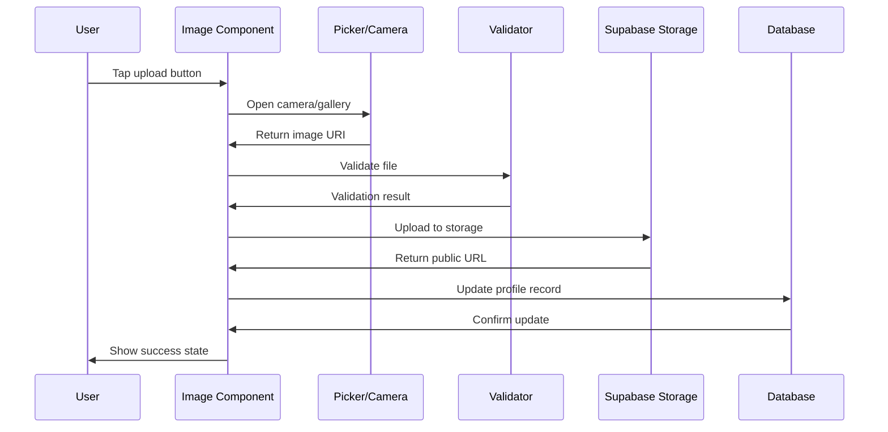
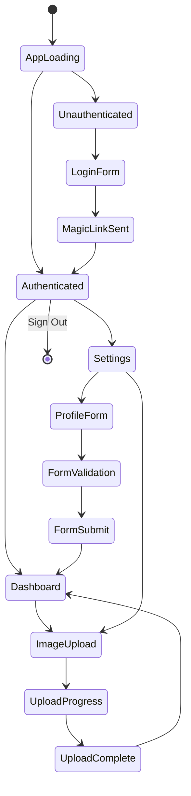

# Expo User Profile Management App Design

## Overview

A React Native Expo application providing comprehensive user profile management with magic link authentication, image uploads, and profile data management. The app leverages Supabase for backend services and implements a modern mobile-first design with cross-platform support.

### Key Features
- Magic link email authentication (passwordless)
- Profile and banner image management with camera/gallery integration
- Real-time profile data synchronization
- Protected routing with session management

### Technology Stack
- **Frontend**: React Native with Expo SDK 51+
- **Backend**: Supabase (Authentication + Database + Storage)
- **Database**: PostgreSQL with Prisma ORM
- **Package Manager**: Bun
- **UI Components**: NativeBase or React Native Elements
- **Navigation**: Expo Router (file-based routing)
- **Form Management**: React Hook Form with Zod validation
- **Image Handling**: Expo ImagePicker + Camera

## Architecture

### Application Structure



### Component Hierarchy



## Authentication System

### Magic Link Flow



### Authentication States

| State | Description | Actions |
|-------|-------------|---------|
| `LOADING` | Checking existing session | Show splash screen |
| `UNAUTHENTICATED` | No valid session | Redirect to login |
| `AUTHENTICATED` | Valid session exists | Access to main app |
| `MAGIC_LINK_SENT` | Email sent, awaiting verification | Show confirmation message |
| `ERROR` | Authentication error | Show error message |

### Protected Routes Implementation

```typescript
// Route Protection Schema
interface RouteConfig {
  path: string;
  requiresAuth: boolean;
  redirectTo?: string;
}

const routes: RouteConfig[] = [
  { path: '/login', requiresAuth: false },
  { path: '/magic-link-sent', requiresAuth: false },
  { path: '/dashboard', requiresAuth: true, redirectTo: '/login' },
  { path: '/settings', requiresAuth: true, redirectTo: '/login' }
];
```

## Data Models & Database Schema

### Prisma Schema

```prisma
model Profile {
  id           String   @id @default(uuid())
  userId       String   @unique
  name         String?
  email        String   @unique
  country      String?
  bio          String?
  avatarUrl    String?
  profileImage String?
  bannerImage  String?
  createdAt    DateTime @default(now())
  updatedAt    DateTime @updatedAt
  
  @@map("profiles")
}
```

### Data Flow Architecture



## Screen Designs & Components

### 1. Authentication Screens

#### Login Screen
```typescript
interface LoginScreenProps {
  onMagicLinkSent: (email: string) => void;
  isLoading: boolean;
  error?: string;
}

// Component Structure
- Container (centered card design)
  - Header (app logo, title)
  - Email Input (with validation)
  - Send Magic Link Button (loading state)
  - Error Message (conditional)
```

#### Magic Link Sent Screen
```typescript
interface MagicLinkSentProps {
  email: string;
  onResendLink: () => void;
  resendCooldown: number;
}

// Component Structure
- Container (success state design)
  - Check Icon
  - Success Message
  - Email Confirmation
  - Resend Link Button (with cooldown)
```

### 2. Dashboard Screen

#### Profile Header Component
```typescript
interface ProfileHeaderProps {
  profile: Profile;
  onImageUpdate: (type: 'profile' | 'banner', uri: string) => void;
  isLoading: boolean;
}

// Component Structure
- Banner Container (3:1 aspect ratio)
  - Banner Image (1200x400px recommended)
  - Upload Button Overlay
- Profile Section
  - Profile Image (96x96px square)
  - User Name
  - User Email
  - Edit Button
```

#### Welcome Section
```typescript
interface WelcomeSectionProps {
  userName?: string;
  lastLogin: Date;
}

// Displays personalized greeting and last login info
```

#### Stats Cards
```typescript
interface StatsCardsProps {
  accountStatus: 'active' | 'pending' | 'inactive';
  profileCompleteness: number;
  memberSince: Date;
}

// Grid of informational cards
```

### 3. Settings/Profile Screen

#### Image Upload Component
```typescript
interface ImageUploaderProps {
  currentImage?: string;
  aspectRatio: 'square' | 'banner';
  onUpload: (uri: string) => void;
  onDelete: () => void;
  maxSizeKB: number;
}

// Component Features
- Image Preview
- Camera Capture Button
- Gallery Selection Button
- Upload Progress Indicator
- Delete Button
- Drag & Drop Support (web)
```

#### Profile Form Component
```typescript
interface ProfileFormProps {
  initialData: Partial<Profile>;
  onSubmit: (data: ProfileFormData) => void;
  isLoading: boolean;
}

// Form Fields
- Name (optional text input)
- Country (optional dropdown/picker)
- Bio (textarea, 500 char limit)
- Email (read-only display)
```

### 4. Navigation Components

#### Drawer Navigation
```typescript
interface DrawerContentProps {
  user: Profile;
  currentRoute: string;
  onNavigate: (route: string) => void;
  onSignOut: () => void;
}

// Navigation Structure
- Header
  - App Branding ("Bubble App")
  - User Avatar
- Navigation Items
  - Dashboard
  - Settings
- Footer
  - Sign Out Button
```

## Image Management System

### Supabase Storage Configuration

```typescript
// Storage Bucket Configuration
const STORAGE_CONFIG = {
  bucketName: 'user-images',
  maxFileSize: 5 * 1024 * 1024, // 5MB
  allowedTypes: ['image/jpeg', 'image/png', 'image/webp'],
  profilePath: (userId: string) => `${userId}/profile-${Date.now()}`,
  bannerPath: (userId: string) => `${userId}/banner-${Date.now()}`,
};
```

### Image Upload Flow



### Image Processing Pipeline

| Stage | Process | Validation |
|-------|---------|------------|
| Selection | Camera capture or gallery pick | File exists |
| Validation | Check file type, size, dimensions | JPEG/PNG/WebP, ≤5MB |
| Upload | Transfer to Supabase storage | Network connectivity |
| Processing | Generate public URL | URL accessibility |
| Cleanup | Remove old images | Storage optimization |
| Update | Save URL to database | Data consistency |

## Form Management & Validation

### Zod Validation Schemas

```typescript
// Profile Form Schema
const ProfileFormSchema = z.object({
  name: z.string().min(1, "Name is required").max(100, "Name too long").optional(),
  country: z.string().max(100, "Country name too long").optional(),
  bio: z.string().max(500, "Bio must be 500 characters or less").optional(),
  email: z.string().email("Invalid email format").readonly(),
});

// Image Upload Schema
const ImageUploadSchema = z.object({
  uri: z.string().url("Invalid image URI"),
  type: z.enum(['profile', 'banner']),
  size: z.number().max(5242880, "File size must be less than 5MB"),
  mimeType: z.enum(['image/jpeg', 'image/png', 'image/webp']),
});
```

### Form State Management

```typescript
interface FormState {
  data: ProfileFormData;
  errors: Record<string, string>;
  isSubmitting: boolean;
  isDirty: boolean;
  isValid: boolean;
}

// React Hook Form Integration
const {
  control,
  handleSubmit,
  formState: { errors, isSubmitting, isDirty },
  reset,
  watch
} = useForm<ProfileFormData>({
  resolver: zodResolver(ProfileFormSchema),
  defaultValues: initialData
});
```

## API Integration Layer

### Supabase Client Configuration

```typescript
interface SupabaseConfig {
  url: string;
  anonKey: string;
  storage: {
    bucket: string;
    maxUploadSize: number;
  };
  auth: {
    redirectTo: string;
    magicLinkOptions: {
      emailRedirectTo: string;
    };
  };
}
```

### Service Layer Architecture

```typescript
// Authentication Service
interface AuthService {
  signInWithMagicLink(email: string): Promise<void>;
  signOut(): Promise<void>;
  getCurrentSession(): Promise<Session | null>;
  onAuthStateChange(callback: (session: Session | null) => void): void;
}

// Profile Service
interface ProfileService {
  getProfile(userId: string): Promise<Profile>;
  updateProfile(userId: string, data: Partial<Profile>): Promise<Profile>;
  uploadImage(file: File, type: 'profile' | 'banner'): Promise<string>;
  deleteImage(imageUrl: string): Promise<void>;
}

// Storage Service
interface StorageService {
  upload(path: string, file: File): Promise<string>;
  delete(path: string): Promise<void>;
  getPublicUrl(path: string): string;
}
```

## State Management Strategy

### Context Providers

```typescript
// Auth Context
interface AuthContextType {
  session: Session | null;
  profile: Profile | null;
  isLoading: boolean;
  signIn: (email: string) => Promise<void>;
  signOut: () => Promise<void>;
  updateProfile: (data: Partial<Profile>) => Promise<void>;
}

// Image Upload Context
interface ImageUploadContextType {
  uploads: Map<string, UploadProgress>;
  uploadImage: (file: File, type: ImageType) => Promise<string>;
  cancelUpload: (uploadId: string) => void;
}
```

### State Flow Diagram



## Error Handling & User Feedback

### Error Categories

| Category | Examples | User Feedback |
|----------|----------|---------------|
| Network | Connection timeout, offline | "Check your internet connection" |
| Validation | Invalid email, file too large | Specific field errors |
| Authentication | Invalid magic link, expired session | "Please sign in again" |
| Storage | Upload failed, storage full | "Upload failed, please try again" |
| Permission | Camera access denied | "Camera permission required" |

### Progress Indicators

```typescript
interface ProgressState {
  type: 'loading' | 'uploading' | 'saving';
  progress?: number; // 0-100 for uploads
  message?: string;
}

// Progress Components
- Spinner for general loading
- Progress bar for file uploads
- Skeleton screens for data loading
- Toast notifications for success/error
```

## Testing Strategy

### Unit Testing Approach

```typescript
// Component Testing Areas
- Form validation logic
- Image upload utilities
- Authentication state management
- Navigation guards
- Data transformation functions

// Testing Tools
- Jest for unit tests
- React Native Testing Library
- Mock Supabase client
- Image picker mocks
```

### Integration Testing

```typescript
// Integration Test Scenarios
- Complete authentication flow
- Profile creation and updates
- Image upload and storage
- Navigation between screens
- Error handling workflows

// Testing Environment
- Expo Development Build
- Supabase test environment
- Mock image files
- Network condition simulation
```

### User Acceptance Testing

```typescript
// Key User Journeys
1. First-time user registration
2. Profile setup with images
3. Profile editing and updates
4. Image replacement workflow
5. Sign out and re-authentication

// Device Testing Matrix
- iOS (iPhone, iPad)
- Android (phone, tablet)
- Web (desktop, mobile browser)
```

## Performance Considerations

### Optimization Strategies

| Area | Strategy | Implementation |
|------|----------|----------------|
| Images | Lazy loading, compression | Expo Image optimization |
| Navigation | Stack navigation efficiency | Expo Router optimization |
| Forms | Debounced validation | React Hook Form optimization |
| Storage | Caching strategy | React Query integration |
| Uploads | Chunked uploads, retry logic | Background task handling |

### Monitoring & Analytics

```typescript
// Performance Metrics
- App startup time
- Screen transition speed
- Image upload success rate
- Form submission latency
- Authentication flow completion

// Error Tracking
- Crash reports
- Upload failures
- Network errors
- User session issues
```